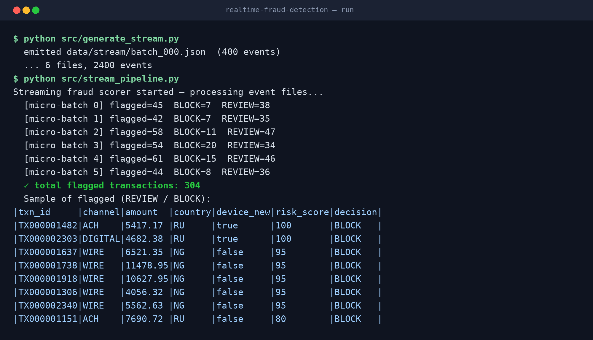
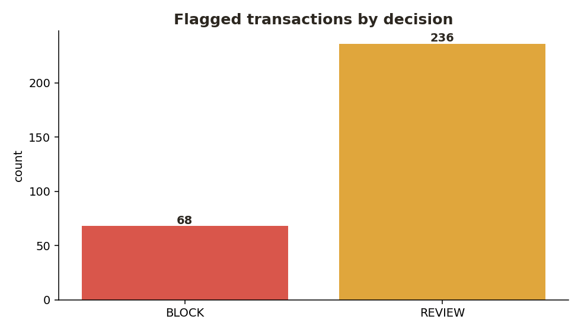

# Real-Time Fraud Detection (Spark Structured Streaming)

A streaming pipeline that scores **card / payment transactions in real time** and routes each to **ALLOW / REVIEW / BLOCK** — the pattern I built for a bank's fraud platform, here on synthetic data so it runs anywhere with just PySpark.

> Portfolio/demo project. No proprietary data or code — same streaming + scoring pattern on generated events.

## Architecture

```
 event files (JSON)  ──▶  Spark Structured Streaming (micro-batches)
                                    │
                                    ▼
                          score() — risk rules
                                    │
                 ┌──────────────────┼──────────────────┐
                 ▼                  ▼                  ▼
              ALLOW             REVIEW              BLOCK
                                    └── written to flagged sink (Parquet) ──▶ analysts
```

A file source stands in for **Kafka / Kinesis**; each file is one micro-batch (`maxFilesPerTrigger=1`). In production this reads from Amazon MSK/Kinesis and writes flagged events to a Snowflake/Delta sink.

## What it demonstrates

- **Spark Structured Streaming** with `foreachBatch` and checkpointing
- Real-time **risk scoring** (amount, geography, device, channel) as a pure, testable transform
- ALLOW / REVIEW / BLOCK routing with a flagged sink
- Micro-batch metrics printed per trigger (throughput + block counts)
- Unit-tested scoring logic (pytest)

## 🔴 Live run & results

Streaming scorer processing event files micro-batch by micro-batch, flagging fraud in real time:



Flagged transactions by decision:



## Tech

`Python` · `PySpark` · `Spark Structured Streaming` · `foreachBatch` · `checkpointing` · `pytest`

## Quickstart

```bash
pip install -r requirements.txt

# terminal 1 — emit the event stream (6 files, 2,400 events)
python src/generate_stream.py

# terminal 2 — start the streaming scorer (runs ~25s for the demo)
python src/stream_pipeline.py

# run tests
pytest -q
```

## Project layout

```
realtime-fraud-detection/
├── README.md
├── requirements.txt
├── src/
│   ├── generate_stream.py   # emits JSON event files (Kafka/Kinesis stand-in)
│   ├── scoring.py           # pure risk-scoring transform
│   └── stream_pipeline.py   # Structured Streaming job + flagged sink
└── tests/
    └── test_scoring.py      # unit tests for the scoring rules
```

## Production notes

On a real platform this runs on **Amazon MSK/Kinesis + EMR/Databricks**, enriches events in-stream (account history, geo, device), guarantees **exactly-once** writes, meets a sub-2-minute decision SLA, and lands fraud/AML marts in **Snowflake**.

## 🧾 Full tech stack — First Citizens Bank — Senior Data Engineer

Every tool from this role on my resume (verbatim):

> AWS · S3 · Glue · DMS · Lambda · EventBridge · Athena · Kinesis · EMR · Step Functions · CloudWatch · Snowflake (Snowpipe, Streams, Tasks) · Apache Iceberg · PySpark · Python · SQL · CDC · Dimensional Modeling · Terraform · Git · Jira · Agile Scrum

---
Built by **Sai Karna** · [portfolio](https://saik85.github.io/) · Lead Data Engineer
